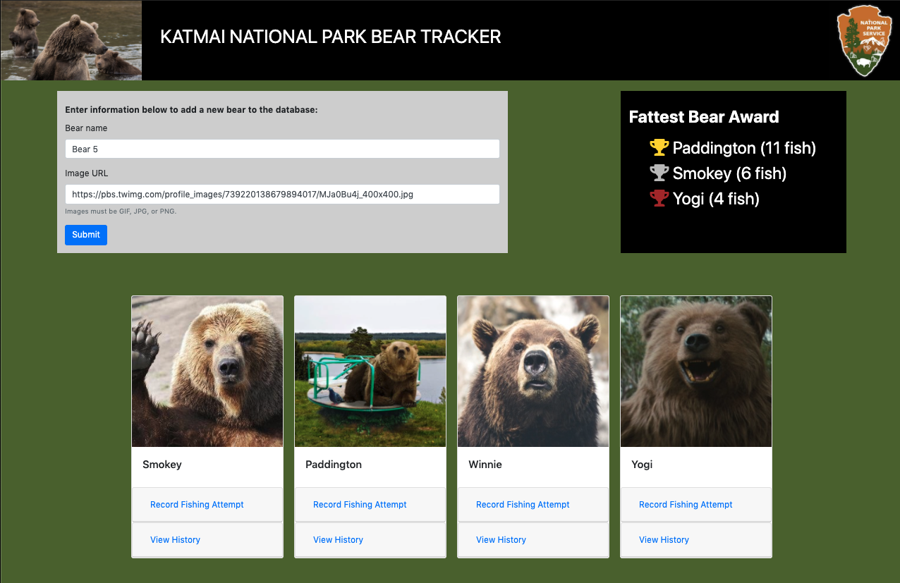

# Bear Watcher

This site was created for the purpose of tracking brown bears in the Katmai National Park congregate along the Brooks River. It designed as a utility with scientists and park rangers in mind.

This project was an assignment as part of my course at [Nashville Software School](http://nashvillesoftwareschool.com/) to learn how to use Javascript modules.

## Features
* Allows user to input a bear name and avatar image to create a new bear
* By default the form gives a bear name and avatar the user can use
* Allows user to add fishing attempts and view each bear's timestamped history with success rate
* Displays a list of the Top 3 (or 4, in the case of a tie for 3rd place) "fattest bears" with color coded trophies

## Screenshot

## Installation
* Clone this repo to your local machine using `https://github.com/petestewart72/bear-watcher`
* Run in any http server with `$ hs`

## Contributors
* [Pete Stewart](https://github.com/petestewart72)

## Technologies Used
  
